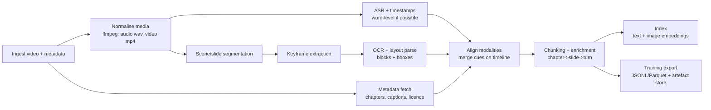

# Extracting rich, GDPR-relevant training data from tutorial videos for LLM fine-tuning

## Executive summary

Tutorial-style videos are unusually information-dense for GDPR and privacy training because the *meaning* often lives in the visual layer: slide text (definitions, legal tests, exceptions), UI screens (cookie banners, CMP settings, DPIA templates), diagrams (data flows), and time-anchored demonstrations. A transcript-only dataset loses precisely the parts you typically need for downstream retrieval and fine-tuning. citeturn2search3turn0search6

A practical “rich extraction” approach is to treat each video as a time-indexed multimodal document with: (a) high-quality ASR with word timestamps and confidence, (b) keyframe/scene segmentation tuned for slide and UI changes, (c) OCR + layout parsing on keyframes (not every frame), and (d) an alignment layer that produces *training-ready chunks* whose boundaries follow chapters → slide changes → speaker turns. This mirrors how people learn from tutorials and reduces hallucination risk when you later use the data in retrieval-augmented generation (RAG) or supervised fine-tuning. citeturn4search0turn0search12turn2search2

From a compliance stance, video processing can involve personal data (faces, voices, names in UI, chat pop-ups). GDPR/UK GDPR therefore pushes you toward data minimisation, privacy by design/default, clear lawful basis, and—if you’re tempted to do face/voice identification—extra caution because “biometric data for the purpose of uniquely identifying” can trigger special-category rules. The safest default for legal-training corpora is usually: avoid identity resolution; detect “speaker turns” without identifying who they are; redact/blur incidental personal data in frames; and keep the minimum needed to reach your learning objective. citeturn7search0turn7search6turn7search1turn7search3

Unspecified aspects that materially affect design choices: target model type (text-only LLM vs multimodal LMM), scale (hours of video), and budget/latency constraints. Below, options are presented for both “text-only with visual-to-text enrichment” and “true multimodal indexing / multimodal fine-tuning”. citeturn4search1turn4search5turn6search1

## Video types and metadata to prioritise

The highest-yield sources are videos where the creator already provides structured navigation and stable visual content. Prioritise:

Instructor-led slide trainings  
These typically have large, OCR-friendly text, stable layouts, and repeated legal frameworks (lawful bases, legitimate interest test, DPIA steps). Slide changes become natural chunk boundaries. citeturn2search2turn11search0

UI walkthroughs and product demos  
Best for extracting *operational compliance know-how* (how a CMP works, where to configure retention, how to respond to DSARs in a portal). Expect smaller text, more motion blur, popovers, and transient tooltips—so you need careful keyframe selection and stronger OCR. citeturn1search2turn1search0

“Regulation explainer + examples” formats  
Often combine slides + live browsing; good for producing paired training items: (rule statement) ↔ (UI evidence). citeturn4search0turn2search3

For each video, prioritise metadata that gives you *free structure*:

Chapters and timestamped descriptions  
Chapters require a 00:00 start, at least three timestamps, and ≥10s minimum per chapter—useful constraints for automatic chunk scaffolding. citeturn0search10

Captions/subtitles as timed text  
YouTube-supported subtitle/caption files include timecodes; some formats may include additional positioning/style info. citeturn0search6turn2search3

Caption track provenance and access constraints  
The official caption download endpoint supports format/language parameters and documents permission errors (e.g., 403 forbidden when not authorised to download a track). Design your pipeline so captions are opportunistic, not assumed. citeturn0search9

Licensing signals for re-use risk management  
Where possible, collect videos clearly marked with permissive licensing such as Creative Commons Attribution (as provided by the platform’s licensing options) and keep licence fields as first-class metadata for governance. citeturn10search5turn10search12

image_group{"layout":"carousel","aspect_ratio":"16:9","query":["tutorial video slide deck screen recording","software UI walkthrough screencast settings panel","YouTube video chapters interface example","presentation slide change in online lecture"],"num_per_query":1}

## Modalities to extract and what to store

A robust training signal comes from *capturing each modality at the level where it is most informative* and recording time anchors everywhere. The minimum “rich” set for your use case:

Audio and ASR transcript with word timestamps  
High-quality ASR gives you the causal “narration layer” you can align to slides and UI events. When you can, prefer word-level timestamps (not just sentence segments) because your alignment layer wants to snap text to slide changes and UI actions. Whisper is widely used as a strong open model trained on large-scale weak supervision, and WhisperX is a common refinement path to obtain word-level timestamps via forced alignment and VAD. citeturn0search2turn0search15turn0search12turn0search1

Timed captions/subtitles and VTT parsing  
When creator captions exist, they can outperform ASR in specialised legal terminology; when only auto-captions exist, they can still provide a second alignment channel. WebVTT explicitly supports captions/subtitles *and* chapter-like timed metadata, which makes it a convenient interchange format for your own derived cues. citeturn2search3turn0search6turn10search1

Keyframes and OCR on frames  
Instead of OCR on every frame, extract candidate keyframes around (a) detected scene cuts, (b) likely slide changes, and (c) interaction moments (mouse movement bursts, window switches). Then run OCR + layout parsing on only those frames. Tesseract provides a widely used open OCR engine (LSTM-based since v4), while modern deep OCR toolkits such as PaddleOCR and docTR provide stronger detection/recognition pipelines for complex layouts and mixed fonts. citeturn1search0turn1search4turn1search1turn11search2

Slide structure  
Treat each stable slide interval as a “visual page”. Store: detected text blocks, reading order, font size/style cues if available, and bounding boxes. Document-layout toolkits (e.g., LayoutParser) can help detect regions (title/body/table/figure-like areas) using pretrained detection models; they’re not slide-specific, but slides are often “document-like” enough for meaningful gains. citeturn11search0turn11search8

UI elements and screen text  
For UI demos captured from video, you usually cannot access DOM. So default to visual methods: OCR + (optional) UI-element detection / grouping (buttons, menus, dialogs) and store bounding boxes and relative hierarchy. If you can reproduce the steps in a live environment (because the tutorial provides a repo + URLs), you can capture DOM snapshots or the accessibility tree using browser tooling, which yields dramatically cleaner semantics than OCR. The Chrome DevTools Protocol includes a DOM snapshot capability, and browser automation tools can snapshot accessibility trees for structure. citeturn12search1turn12search0turn12search2

Speaker cues  
For GDPR training videos, speaker identity is rarely essential. What *is* useful is: speaker turn segmentation, emphasis gestures pointing at slide regions, and “the instructor is demonstrating now” signals (face-cam appears, screen share starts). Speaker diarisation toolkits segment “who spoke when” without requiring identification; pose/hand landmark detectors can help detect pointing/gestures, but you should treat these as high privacy sensitivity if you ever cross into identification. citeturn3search1turn3search0turn3search20turn7search4

## Aligning modalities into training-ready chunks

Alignment is the difference between “a pile of extracted text” and “a dataset that actually teaches an LLM how to answer grounded questions with timestamps”.

Temporal backbone  
Use a single canonical timeline in milliseconds from t=0. Attach every artefact to it: ASR words, caption cues, scene cuts, slide IDs, OCR blocks, UI events. WebVTT’s core framing as timed cues maps naturally to this representation even when the cue content is your own derived metadata. citeturn2search3turn0search6

Shot and slide segmentation  
A pragmatic approach is to run content-aware scene detection to find “visual discontinuities”, then classify each segment as slide / screen demo / talking head. PySceneDetect’s content-aware detector operationalises this as frame-to-frame difference with a tunable threshold—useful because tutorial videos often have hard cuts when switching windows or slides. citeturn2search2turn2search6

Forced alignment and ASR confidence gating  
When you rely on ASR, use a model that can provide word timestamps; then refine them via forced alignment to reduce drift over long videos. WhisperX is explicitly designed to improve timestamp accuracy using VAD and forced phoneme alignment, yielding word-level timestamps that you can anchor to slide changes. Use ASR confidence (or proxy signals like alignment failure rates) to decide whether to trust ASR vs captions vs OCR for any interval. citeturn0search12turn0search3turn0search1

Keyframe selection rules  
Keyframes should be chosen to maximise “readability yield per OCR cost”. Common heuristics that work well in tutorial videos:

▸ pick the first sharp frame after a detected slide change (avoid transition fades)  
▸ pick additional frames when OCR text differs materially from the last stored frame (delta-OCR)  
▸ for UI demos, sample more densely around interaction bursts (cursor motion, scrolling) and less densely during idle narration

The reason to emphasise *sharp frames* is OCR sensitivity to blur and compression artefacts, which are common in screen recordings. Deep OCR toolkits explicitly separate text detection and recognition; feeding them poor frames wastes compute and harms recall. citeturn1search1turn11search2

A minimal alignment timeline to aim for is:

```mermaid
timeline
    title Tutorial video alignment spine
    00:00 : Ingest metadata (title, chapters, caption tracks)
    00:10 : ASR + word timestamps
    00:15 : Scene/slide segmentation -> segments (t_start, t_end, type)
    00:20 : Keyframe extraction per segment
    00:30 : OCR + layout parse on keyframes -> text blocks + bboxes
    00:40 : Merge cues -> multimodal chunks (chapter -> slide -> speaker turn)
    00:50 : Index embeddings + store artefacts
```

## Practical tools and libraries with trade-offs

The table below focuses on components that matter most for *slides + UI + timestamps*.

| Component | Open-source options | Commercial/managed options | Practical pros | Practical cons | Recommended default if unspecified |
|---|---|---|---|---|---|
| Video download + metadata | `yt-dlp` for collection at scale; FFmpeg for transcoding citeturn2search1turn2search4 | Platform APIs when possible (metadata/captions endpoints) citeturn10search3turn0search9 | Reliable automation; Linux-friendly workflows | Downloading may be constrained by platform terms; captions download can be permission-limited citeturn9search0turn0search9 | Prefer official APIs for metadata/captions; treat direct download as governed ingestion |
| Captions parsing | WebVTT parsing per W3C (chapters + metadata cues supported) citeturn2search3 | — | Simple; time-aligned | Captions may be missing or low-quality | Always ingest if present; keep provenance fields |
| ASR + timestamps | Whisper + WhisperX refinement citeturn0search2turn0search12 | entity["company","Google","tech company"] Speech-to-Text word time offsets citeturn13search0; entity["company","Amazon Web Services","cloud provider"] Transcribe word timestamps + diarisation citeturn13search17turn13search1; entity["company","Microsoft","tech company"] Speech SDK word-level timestamps citeturn13search18; entity["company","Deepgram","speech ai company"] diarisation + timestamps citeturn13search11turn13search3 | Managed options simplify scaling + diarisation | Cost + data transfer + contractual constraints; diarisation quality varies | For cost control and data locality: Whisper(+WhisperX). Use managed ASR when you need enterprise SLAs |
| Scene / slide change detection | PySceneDetect content-aware detection citeturn2search2turn2search6 | — | Fast; decent for hard cuts | Must tune thresholds; less robust for subtle UI changes | PySceneDetect + slide-specific heuristics (SSIM / histogram deltas) |
| OCR | Tesseract (LSTM), PaddleOCR, docTR citeturn1search0turn1search1turn11search2 | Cloud OCR (e.g., Vision OCR, Textract) citeturn1search2turn1search3turn1search6 | PaddleOCR/docTR often beat classic OCR on complex scenes | OCR cost can dominate pipeline; UI text can be tiny | PaddleOCR or docTR for modern accuracy; Tesseract for lightweight baselines |
| Layout parsing / structure | LayoutParser for region detection + reading order citeturn11search0turn11search8 | Document AI suites | Better slide semantics than plain OCR text | Models are document-biased; slides vary | LayoutParser + task-specific post-processing |
| Speaker diarisation | pyannote.audio; NVIDIA NeMo diarisation citeturn3search0turn3search4 | Some managed ASR provide diarisation citeturn13search1 | Enables “speaker turn” chunking | Sensitive personal data; avoid identification by default | Diarise for turn boundaries only; store anonymous speaker labels |
| RAG orchestration | LlamaIndex multi-modal RAG; LangChain multimodal message types citeturn6search1turn6search15 | — | Rapid prototyping; connectors | Abstractions can hide latency/cost | Keep orchestration thin; store rich artefacts in your own schema |
| Vector storage and filtering | Qdrant payload + payload indexing citeturn5search2turn5search14; Milvus hybrid/multi-vector search citeturn5search3turn5search7; Weaviate multimodal CLIP module citeturn6search2 | Pinecone hybrid search (two-index approach) citeturn6search3 | Filtering by time, slide ID, modality is crucial | Multi-vector/hybrid adds systems complexity | Use a vector DB that supports rich metadata filtering + (optionally) multi-vector |

Recent multimodal video RAG research reinforces why you should *not* collapse video into a single text description: retrieval benefits from keeping visual and textual evidence available at query time. VideoRAG-style systems explicitly target retrieval + generation over video corpora using both modalities, and video instruction-tuning work (e.g., LLaVA-Video, Video-LLaVA) highlights the data and alignment difficulty as a central bottleneck. citeturn4search0turn4search1turn4search5

## End-to-end pipeline architecture and storage schema

A reference architecture that fits both “fine-tuning dataset generation” and “video RAG index”:



Ingestion and governance  
If you are collecting from YouTube, treat platform terms and API policies as first-class constraints. The platform’s terms include explicit “permissions and restrictions”, and the official API policies govern compliant usage of API-derived data. Design your ingestion so it can be configured to only process sources you have rights to use (e.g., your own uploads, explicit permissions, or CC BY where appropriate). citeturn9search0turn9search1turn10search5

Preprocessing formats and temporal granularity  
A common, robust baseline:

▸ Audio: 16 kHz mono WAV for ASR/diarisation (many diarisation pipelines assume 16 kHz mono) citeturn3search3  
▸ Video: H.264 MP4 with constant frame rate (helps consistent timestamp mapping) citeturn2search4  
▸ Timeline unit: integer milliseconds (ms) for all events  
▸ Keyframes: JPEG/WEBP at 720p–1080p; keep original aspect ratio for OCR bounding boxes

Chunking rules that work for tutorials  
Use hierarchical chunking:

Chapter chunk → Slide chunk → Speaker-turn subchunk

This respects the creator’s intended structure (chapters), the visual semantics (slides/UI scenes), and discourse units (speaker turns). Chapters can be derived from timestamp lists when present; slides are derived from scene/slide segmentation; turns from diarisation. citeturn0search10turn2search2turn3search1

Metadata enrichment fields  
At minimum, add:

▸ provenance: video id, channel/source, publish date, licence, caption source (human vs auto vs ASR), tool versions  
▸ structure: chapter title, slide index, slide type (slide/ui/talking head), window/app hints (if detectable)  
▸ quality: ASR confidence proxies, OCR confidence, blur score for keyframes, alignment “health” flags  
▸ privacy flags: face present, on-screen personal data suspected, redaction applied

Vector DB schema sketch  
Use separate “points” per chunk, with payload fields for efficient filtering (time-range, modality, slide ID). Vector DBs such as Qdrant explicitly support JSON-like payload metadata and payload indexing for filter efficiency; multi-vector/hybrid approaches in systems like Milvus can store separate vectors (e.g., text embedding + image embedding) for the same logical chunk. citeturn5search2turn5search14turn5search7

Example payload (conceptual):

```json
{
  "doc_type": "video_chunk",
  "source": "youtube",
  "video_id": "...",
  "t_start_ms": 123450,
  "t_end_ms": 156780,
  "chapter_title": "Lawful basis and legitimate interests",
  "slide_id": 7,
  "speaker_turn": "spk_2",
  "asr_text": "...",
  "ocr_text": "...",
  "has_keyframe": true,
  "keyframe_uri": "s3://.../frame_000123.jpg",
  "privacy": { "face_present": true, "redacted": true }
}
```

Embedding strategies for text+image fusion  
Two dominant patterns:

Dual-index retrieval (late fusion)  
Store a text embedding for enriched text (ASR + OCR + extracted UI labels) and an image embedding for keyframes; retrieve top-k from each, then merge/rerank. This is often simpler operationally and aligns with multi-vector search capabilities. citeturn5search7turn6search2

Joint embedding space (single-model)  
Use a contrastive text-image model (CLIP/OpenCLIP family) so both text queries and images map to a shared space. This supports text→image and image→text retrieval for “show me the slide where…” queries, which are common in tutorial corpora. citeturn5search5turn5search0turn6search2

RAG prompt template for grounded answers with timestamps  
Keep prompts strict about quoting evidence and returning timecodes:

```text
System: You answer using ONLY the retrieved evidence. If evidence is insufficient, say so.
User question: {question}

Evidence packets (time-anchored):
- [t={t_start}-{t_end}] ASR: {asr_text}
- [t={t_start}-{t_end}] OCR: {ocr_text}
- [t={t_start}-{t_end}] Slide title/layout: {slide_summary}
- [t={t_start}-{t_end}] UI elements: {ui_elements}

Task:
1) Give a concise answer.
2) Cite the best supporting timestamps (start-end).
3) If there is a relevant slide/UI text quote, include it verbatim (short).
```

This pairs well with video-RAG findings that retrieval and generation should be visually and temporally grounded rather than relying on free-form summaries. citeturn4search0turn4search12

## Slide semantics, UI capture, speaker cues, and validation under GDPR constraints

Slide semantics extraction  
A layered strategy is usually best:

▸ OCR text + bounding boxes (baseline) citeturn1search1turn11search2  
▸ layout parsing to label regions (title/body/table/figure-like blocks) using tools such as LayoutParser citeturn11search0turn11search8  
▸ table/figure handling: for slide screenshots, you typically need heuristics (detect grid-like regions) or document-parsing toolkits; managed services like Textract explicitly expose table structure for document images, which can be useful if you treat “slide = document page” citeturn1search6turn1search3  
▸ slide-to-text summarisation: optionally run a vision-language step that produces a structured “slide meaning” (definitions, obligations, exceptions). If you do this, keep the original OCR and citeable evidence alongside the summary so downstream systems can verify. (Video instruction-tuning research repeatedly shows that high-quality aligned supervision is hard; you should preserve raw evidence.) citeturn4search1turn4search5

UI / website capture: DOM snapshot vs visual OCR  
From video alone, you’re constrained to pixels. But if you can reproduce the walkthrough (common when tutorials share links/repos), capturing DOM or accessibility structure is superior:

DOM snapshot  
The Chrome DevTools Protocol can capture a DOM snapshot including the full DOM tree plus layout and whitelisted computed styles—ideal for reconstructing form labels, button semantics, and stable identifiers. citeturn12search1turn12search13

Accessibility tree snapshot  
Automation tooling can snapshot a page’s accessibility tree, which often compresses the UI into semantically meaningful nodes (roles, names). Playwright explicitly supports aria snapshots as a YAML representation of the accessibility tree; Puppeteer has an accessibility snapshot API as well. citeturn12search0turn12search2

Speaker cues with privacy by design  
If the goal is “what was explained when?”, diarisation plus anonymous speaker labels is usually enough. Open diarisation toolkits formalise this as “who spoke when” segmentation, and this can drive chunk boundaries without identity resolution. If you add face/gesture analysis, restrict it to coarse signals (face present, pointing motion) and avoid persistent identity features unless you have a compelling lawful basis and strong safeguards. citeturn3search1turn7search1turn7search4

GDPR/UK GDPR compliance notes  
Key obligations that directly affect your pipeline design:

▸ Data protection principles and lawful basis: you need a lawful basis and must respect purpose limitation and data minimisation. Your extraction should be scoped to compliance-learning objectives, not “collect everything because we can”. citeturn7search0turn8search6  
▸ Privacy by design and default: implement safeguards in the pipeline itself (redaction, minimised retention, access controls). citeturn7search1turn7search5  
▸ Pseudonymisation vs anonymisation: pseudonymised data can remain personal data; don’t assume you’re “out of GDPR” because you removed names. This matters when storing diarisation tracks or face crops. citeturn7search3turn7search0  
▸ Video processing guidance: regulators emphasise proportionality and careful purpose definition when processing video data, which is applicable by analogy when you process tutorial videos that include people’s images or incidental personal data. citeturn7search6turn8search1

Validation and dataset design

Evaluation metrics  
Use metrics per stage, not just “did the final model improve”:

▸ OCR: character error rate (CER) + word-level precision/recall on key fields (e.g., article numbers, definitions, button labels)  
▸ Alignment: mean absolute error (ms) between labelled “slide change” time and predicted boundary; word-to-slide assignment accuracy (how often a spoken definition is matched to the correct slide)  
▸ Retrieval: Recall@k / nDCG for queries like “What are the three conditions for legitimate interest?” with expected slide/time answers (video RAG papers motivate evaluating retrieval + generation together). citeturn4search0turn4search16  
▸ Downstream fine-tuning: task-specific accuracy on held-out Q&A grounded in your extracted evidence; also measure citation correctness (timestamps point to supporting evidence).

Suggested small validation set  
A lean but useful first benchmark:

Sample size  
30–50 videos, stratified: 15 slide-heavy, 15 UI-heavy, 5 mixed “slides + browsing”, 5 “hard cases” (low bitrate, heavy cursor motion, small text). This size is enough to estimate error modes without becoming a labelling project. citeturn2search2turn1search1

Labels to collect  
Per video, label:

▸ ground-truth chapters (if present) and 20–40 slide-change timestamps  
▸ 200–400 OCR boxes with correct transcription (focus on GDPR keywords, article numbers, UI labels)  
▸ 50–100 “query → timestamp span(s)” retrieval targets (natural compliance questions)  
▸ privacy flags: face present, personal data visible, redaction required

Edge cases to include  
▸ picture-in-picture webcam overlay  
▸ scrolling tables of legal text  
▸ cookie banner dark patterns with tiny fonts  
▸ demos showing real email addresses / names (tests redaction)

Compute and cost considerations  
The dominant cost drivers are OCR and frame processing. Scene/keyframe filtering is the primary lever to reduce GPU/CPU spend. Batch processing is typically more cost-effective than streaming unless you have near-real-time needs; store intermediate artefacts (keyframes, OCR JSON, ASR JSON) so you can iterate on alignment/chunking without re-running OCR/ASR. Video foundation model work (e.g., InternVideo variants) and video instruction tuning both underscore that full-video modelling is expensive; your pipeline should therefore keep “heavier” models optional and targeted. citeturn4search2turn4search6turn4search1